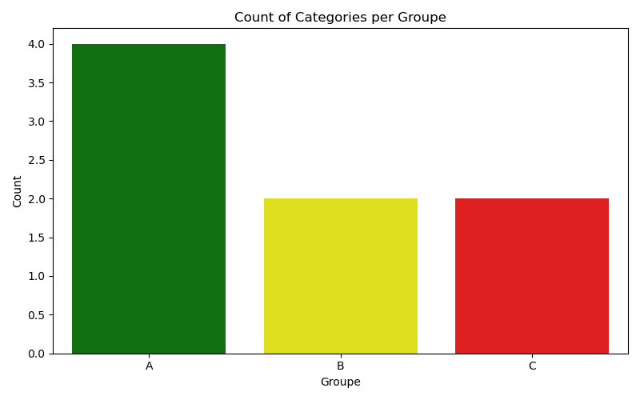
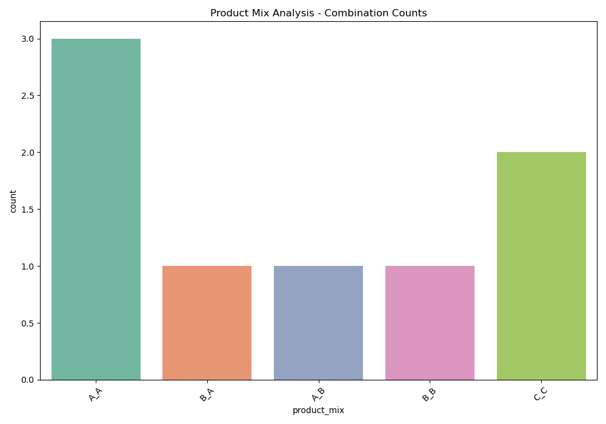

# Food Price Analysis & ABC Classification

This project analyzes food price data from Algerian markets using Python and provides actionable business insights through data cleaning, ABC analysis, product mix analysis, and clear visualizations.

## Features

- **Automated Data Cleaning:** Handles missing values, formats prices, and removes duplicates.
- **ABC Analysis:** Classifies product categories by their sales impact using cumulative thresholds and visualizes the results.
- **Product Mix Analysis:** Identifies and visualizes top-performing product combinations.
- **Market & Category Summary:** Summarizes total sales and revenue by market and product category.
- **Visualization:** Uses Seaborn and Matplotlib for clear, business-ready charts.

## Technologies Used

- Python (`pandas`, `numpy`, `seaborn`, `matplotlib`)
- `inventorize` for ABC/product mix analysis

## How to Use

1. Clone this repository.
2. Place your data file (e.g., `Food_prices_dz.csv`) in the project directory.
3. Run the main script:
   ```bash
   python food_price_analysis.py
   ```
4. View the generated plots and summaries in your output directory and terminal.

## Example Outputs

- **ABC Analysis:**  
  
- **Product Mix:**  
  
- **Market & Category Summary:**  
  Printed in the terminal.

## Why This Matters

This project demonstrates how Python can turn raw retail data into actionable insights for inventory management, sales strategy, and business decision-making.
